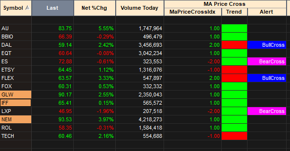

# MA Price Cross

Tradestation indicator that indicates price crosses against a Moving Average. And displays the *trend* direction based on the price position relative to the Moving Average starting from that cross.

*My primary use for this is within Tradestation's Scanner.*

*Example displays crossings against the 20 period Simple Moving Average (SMA), indicated by the light blue light.*

Radarscreen provides some visual cues for easier scanning.

#### NOTE

- Price cross is determined by a prior Close below and the current Close above the Moving Average for a bullish scenario (and vice versa).
- Radarscreen Trend display will only update at the confirm of EOD. Till then it will maintain the prior trend state. All other plots will update intraday.

#### TODO

- [ ] Add an option to support Price Cross based on High/Low touches against the MA.
- [x] Better visual support in Radarscreen (currently that is not it's main use case)

