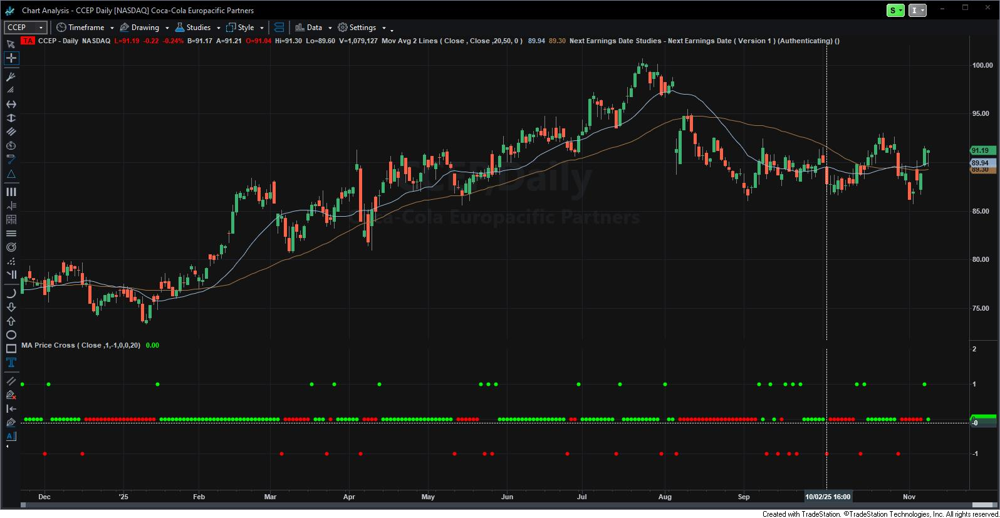

# MA Price Cross

Tradestation indicator that indicates price crosses against a Moving Average. And displays the *trend* direction based on the price position relative to the Moving Average starting from that cross.

*My primary use for this is within Tradestation's Scanner.*

#### NOTE

- Price cross is determined by a prior Close below and the current Close above the Moving Average for a bullish scenario (and vice versa).

#### TODO

- [ ] Add an option to support Price Cross based on High/Low touches against the MA.
